<!-- Full-page animated profile README. All animations are SVG files in /assets (GitHub renders SVG via ). -->

  
  
  
  
  

<b>Read the full professional summary</b>

 

Angular specialist and full stack engineer with 4+ years building scalable, production-grade web applications, with deep expertise in **Angular (v14-21), TypeScript, RxJS, and Signals**, complemented by Java/Spring Boot backend integration. Proven track record leading Angular version migrations, performance optimization, and reusable component architecture in high-stakes banking and fintech environments.

Delivered **Loan Origination Systems, AEPS, Micro-ATM, Recharge, Bill Payments, Cash-Out, and financial dashboards** for major banking clients, integrating REST APIs, JWT authentication, RBAC, Aadhaar-based device SDKs, and MySQL. Skilled at modernizing legacy Angular codebases, cutting UI latency, and reducing production defects through disciplined debugging and code review.

Comfortable owning frontend architecture end-to-end in Agile/Scrum teams, from reactive-forms design through lazy loading, module splitting, and interceptor-based security, with backend fluency to unblock full-stack delivery.

<b>Full tech stack table</b>

 

| Category | Technologies |
|--------|-------------|
| **Angular (Primary)** | Angular 14-21, RxJS, Signals, Reactive Forms, Angular Material, Lazy Loading, Module Splitting, Interceptors, Zone-less Change Detection, Angular 19→21 Migration |
| **Frontend** | TypeScript, JavaScript, HTML5, CSS3, SCSS, Bootstrap, Tailwind, PWA, TWA, Cross-browser Compatibility |
| **Backend** | Java, Spring Boot, REST APIs, JWT Authentication, Spring Security, Microservices |
| **Database** | PostgreSQL, MySQL |
| **Architecture & Security** | RBAC, Reusable Component Design, Aadhaar Authentication, Debugging & Performance Optimization |
| **Device Integration** | Mantra, Morpho, Micro-ATM SDKs |
| **Tools** | Git, GitHub, GitHub Actions, Postman, IntelliJ IDEA, Jira, Docker |

<b>Full experience details</b>

 

**Software Engineer (Angular + Java), Vastika Technologies** (Dec 2024 - Sept 2026, Contract)
* Led Angular-based multi-step loan journey development for ADCB Loan Origination System, improving loan onboarding workflow efficiency by 30%.
* Delivered user stories, resolved production bugs, and shipped UI enhancements against business requirements in sprint cycles.
* Engineered dynamic, backend-flag-driven UI rendering for ROI, processing fees, security, stock statements, and credit limits.
* Built document upload, customer data capture, eligibility verification, and application tracking modules end-to-end in Angular.
* Enhanced dealer-focused loan workflows and dashboards for Axis Bank Loan Origination System (LOS).
* **Led the Angular 19 → 21 migration**: upgraded dependencies, resolved breaking changes, and refactored deprecated APIs for a zero-downtime transition.

**Software Engineer (Angular + Java), Redmil Business Mall** (May 2024 - Nov 2025)
* Maintained and extended Angular-based fintech applications integrated with a Java Spring Boot backend.
* Built AEPS, Micro-ATM, Recharge, Bill Payment, and Cash-Out modules with full end-to-end REST API integration.
* Implemented JWT-based RBAC across Admin, Agent, and Retailer user roles.
* **Integrated Mantra, Morpho, and Micro-ATM device SDKs** for Aadhaar-based authentication, cutting transaction errors by 40%.
* Collaborated with backend teams to optimize REST APIs, strengthen error handling, and harden API security.
* Built Spring Boot REST APIs for data extraction and export, improving processing efficiency and scalability.

**Angular Developer, Redmil Business Mall** (Apr 2022 - Apr 2024)
* Enhanced Angular-based financial applications with new features, improving scalability and performance.
* Resolved UI/UX issues and API synchronization challenges in HDFC Loan CRM, cutting lead processing time.
* Designed reusable Angular components for real-time financial dashboards, cutting development effort for new modules by 40%.
* Reduced UI latency by 35% through zone-less patterns and manual change detection techniques.

  <picture>
    <source media="(prefers-color-scheme: dark)" srcset="https://raw.githubusercontent.com/satendra2rajput/satendra2rajput/output/github-snake-dark.svg" />
    <source media="(prefers-color-scheme: light)" srcset="https://raw.githubusercontent.com/satendra2rajput/satendra2rajput/output/github-snake.svg" />
    
  </picture>

  
  

  

  📧 <a href="mailto:satendracaria@gmail.com">satendracaria@gmail.com</a> &nbsp;•&nbsp;
  🌐 <a href="https://www.satendra2rajput.com">satendra2rajput.com</a> &nbsp;•&nbsp;
  💼 <a href="https://linkedin.com/in/satendra2rajput">LinkedIn</a>

